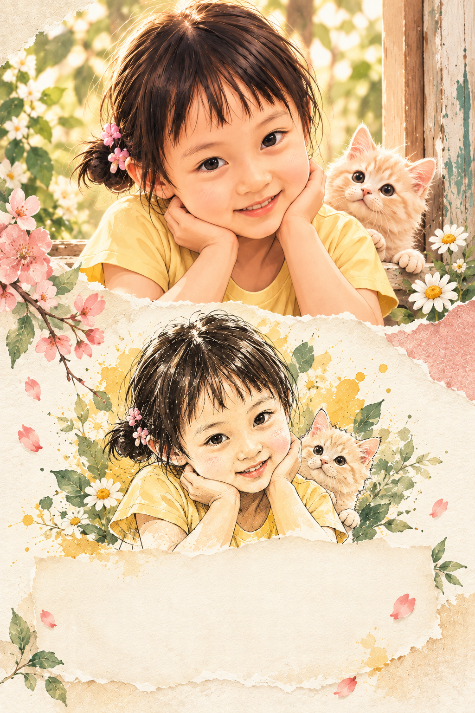

# jwan-photo-poem-poster

Jwan photo-and-illustration memory poster Skill with a short poetic caption below the image.

## Features

- Pair one supplied photo with one illustrated visual echo.
- Preserve the subject's identity, pose, clothing cues, and emotional gesture.
- Place a short Chinese caption below the image with an optional small English companion line.
- Keep the final poster warm, tactile, calm, and suitable for social sharing.

## Case

## Usage

Use `$jwan-photo-poem-poster` followed by one photo. Add a theme, exact caption, color preference, or aspect ratio when needed.

Example:

`$jwan-photo-poem-poster，保留照片主体，下面配一幅轻松的手绘插画，文字放在图下方。`

## Repository structure

- `SKILL.md` — complete Skill definition
- `examples/` — generated case images
- `README.md` — usage and project notes
- `LICENSE` — MIT license

## Source

This Skill is整理自 ChatGPT 项目“插画拼接图处理”中的聊天实践，由 Jwan 重新编写为可复用的公开 Skill。案例图为生成后的展示素材，不包含用户原始照片文件。

## License

Released under the MIT License. See `LICENSE`.
